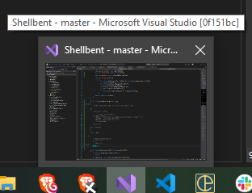
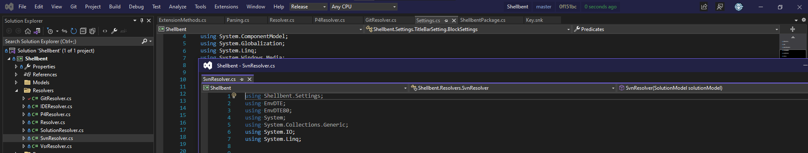

# Shellbent

Hello.


## what it is
Shellbent is a Visual Studio plugin that allows you to change the text & colouring of Visual Studio's title bar. It can react and display information from the loaded solution's filepath, and the repository information of Git, Svn, Perforce, or Versionr source-control systems.

## settings file
Shellbent is configured through settings files named `.shellbent` in either the user directory, the solution directory, or a parent directory of the solution. Shellbent will respond to changes to the file(s) in realtime, so you may quickly iterate on your works of art. The per-solution settings file takes priority over the user directory settings file. The per-solution file is the first `.shellbent` file found walking up the directory tree from the loaded solution's `.sln` file location.

## settings format
The settings files are written in YAML.

The top-level element is an array of objects that configure Visual Studio. The ordering is important, as the settings are visited in-order until satisfied. Placing a catch-all setting at the bottom makes sense.

### predicates
---
This is a list of strings that determine if the object is applicable for a given situation.\
 
A list of possible predicates is given below.
  
``` yaml
# this configuration object is only applicable when we're in a git repo
- predicates: [git]

# this configuration object is only applicable when we're in the master branch.
# this naturally implies the "git" predicate
- predicates: [git-branch =~ master]

# combining predicates for very specific behaviour
- predicates: [solution-name =~ Shellbent, git-branch =~ release]
```

### title-bar-caption
---
All versions: Modifies the thumbnail caption (show below)
Visual Studio 2017 only: Modifies the text display in the title bar
``` yaml
# this is the standard title-bar template that mimics Visual Studio
  title-bar-caption: $item-name?ide-mode{ $} - $ide-name

# below, pictured, a modified version
  title-bar-caption: $solution-name - $git-branch $ide-mode?{ $}- $ide-name [$git-sha]
```


### title-bar-background
---
Visual Studio 2017: Changes the background colour of the title-bar, and floating windows.\
Visual Studio 2019+: Changes the background colour of the menu-bar that serves as the title-bar, as well any floating windows & tool windows.
  ``` yaml
  # a dark blue background
    title-bar-background: "#224"
  ```


### title-bar-foreground
---
Visual Studio 2017: Changes the text of color of the title-bar.\
Visual Studio 2019+: No change

### blocks
---
(_Visual Studio 2019+ only_)\
An array of setting objects. These add additional blocks of information to the right of the item-name block that replaced the title-bar in Visual Studio 2019+.
  ``` yaml
  # add git information in three separate blocks
  - blocks:
    - text: $git-branch
      foreground: "#cc6"
      background: "#000"
    - text: $git-sha
      foreground: "#acf"
    - text: $git-commit-time-relative
      foreground: "#4d9" 
  ```
  Result:\
  


## predicates

Predicates allow a configuration to be limited to certain situations.

**Basic filters** \
These filters are a boolean yes or no value if the given state is available. The filter `solution` evaluates to `true` if a solution is loaded. The remaining filters are about the presence of source-control systems. This is determined by recursing up the folder heirarchy of the solution/document. These basic filters are:
 * `solution`
 * `git`
 * `vsr`
 * `svn`
 * `p4`

Example
``` yaml
# solution part of a git repo
- predicates: [git]

# solution part of a git repo & a p4 repo
- predicates: [git, p4]
```

**Regex filters**\
Regex filters llow you to match a property against a basic glob regex. This is specified with the regex operator `=~`. The available properties are:
 * `git-branch`
 * `git-sha`
 * `p4-client`
 * `p4-view` *
 * `svn-url`
 * `vsr-branch`
 * `vsr-sha`
 * `solution-name`
 * `solution-path`

Examples:

``` yaml
# only matches against solutions that are called exactly best_solution
- predicates: [solution-name =~ best_solution]:

# matches against solutions that begin with 'best-', and end with '-dragon'
- predicates: [solution-name =~ best-*-dragon]:

# matches when the solution 'awkward_dragon' is part of a git repository
- predicates: [git, solution-name =~ awkward_dragon]:
```

## patterns

Finally, a Directive contains the pattern which changes the Visual Studio title bar. These patterns contain text and tags that will get replaced with values. The values of the tags are predetermined by the availability of source-control, or are provided by Visual Studio itself.

**Always Available Tags**

 * `ide-name` - "Microsoft Visual Studio"
 * `ide-mode` - "(Debugging)", "(Running)", or ""

**Solution Tags**
 * `solution-name` - The name of the solution
 * `solution-path(`_optional_args_`)` - A psuedo-function. Left as just `$solution-path`, it evaluates to the full solution path. As `$solution-path(0, 2)`, it 
will act as a function, and return n (here n=2) directories starting from the specified directory, where x (here x=0) specifies the leaf directory, 1 specifies the parent directory of the leaf, etc.\
\
For example, given path `D:\hooray\best\things\mysolution.sln`\
\
`$solution-path(0, 2)`  would return `best\things`\
`$solution-path(1, 1)` would return `best`

**git Tags**
 * `git-branch` - The name of the currently active git branch
 * `git-sha` - The SHA of the current commit
 * `git-commit-time-relative` - The duration relative to now of when the commit was made ("A few minutes ago", "7 days ago", etc)
 * `git-author` - The author of the commit

**versionr Tags**
 * `vsr-branch` - The name of the currently active versionr branch
 * `vsr-sha` - The SHA of the current versionr version

**SVN Tags**
 * `svn-url` - The url of the SVN repository

Tags are enabled by prefixing with `$`. Enclosing scopes are defined with braces. Scopes can be predicated when tags are appended with `?`, otherwise the `$` tags will always be attempted to be substituted. When a tag-scope is started with a predicate (a tag with a question mark at the end), a single dollar-sign can be used instead of spelling out the same tag again.

# examples

``` yaml
# here, this pattern group is enabled if we're in a git repository, and we have a
# solution opened. we always prefix with the git branch, then the solution-name,
# then, *if* the IDE Mode is available, we provide a space followed by the ide-mode.
# Then the IDE name, followed by the SHA of the current git commit.
#
# lets break down '$ide-mode?{ $}' 
#
# we check to see if ide-mode is available (it is not when you're neither debugging nor running).
# if it *is* available, everything inside the braces is included, which is a space followed by
# the tag '$'. A single dollar-sign refers to the tag that initiated the enclsoing scope - in
# this case that tag is "ide-mode".

pattern-group[git, solution]:
 - solution-opened: $git-branch - $solution-name$ide-mode?{ $} - $ide-name [$git-sha]
```

A versionr setup
```
pattern-group[vsr]:
 - item-opened: $vsr-branch/$item-name?ide-mode{ $} - $ide-name, sha=$vsr-sha

```

Because pattern-groups are applied in-order, the following colour directives would augment
the above rules. Here the colour of the title bar will be red, since we're in the production
branch:

```
pattern-group[git-branch =~ production]:
 - color: #f00
```

Here we change the colour to purple when we're opened in a location that contains both versionr and SVN source-control systems (maybe for replication):

```
pattern-group[vsr, svn]:
 - color: #f0f
```